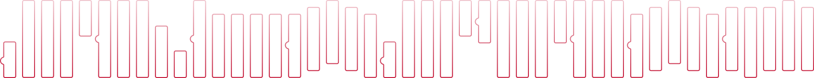
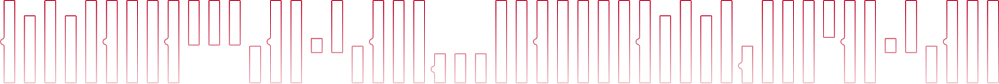

# Hello there!

**I'm Sebastian** _— Full-Stack Developer, SysAdmin, DevOps, and Designer —_ **a Jack-of-All-Trades from Poland.**

In IT since 2013, programming since 2015, with Node.js since 2019.

## Technologies I work with

## Certificates
- [**Software Engineer**](https://www.hackerrank.com/certificates/ccf26368dc8e) — HackerRank, March 2025
- [**Frontend Developer (React)**](https://www.hackerrank.com/certificates/cc64bf036d27) — HackerRank, December 2024
- [**Node.js (Intermediate)**](https://www.hackerrank.com/certificates/929d0f789294) — HackerRank, December 2024
- [**JavaScript (Intermediate)**](https://www.hackerrank.com/certificates/ec0c9084d54c) — HackerRank, December 2024
- [**Graph Developer - Professional**](https://www.apollographql.com/tutorials/certifications/5597fc96-d7b7-4a10-bda9-84189dd071cf) — Apollo, March 2023

